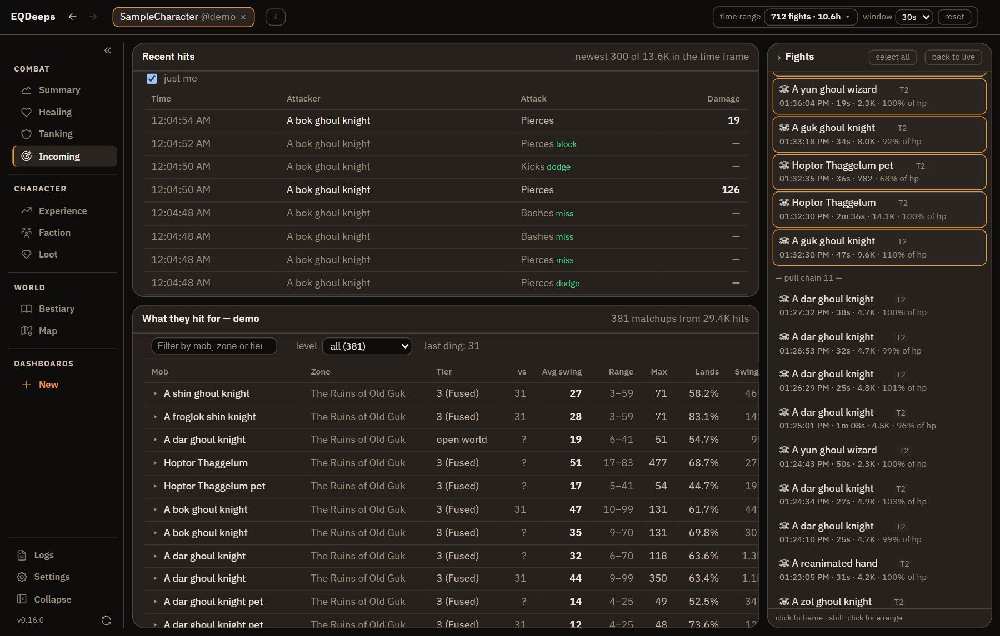
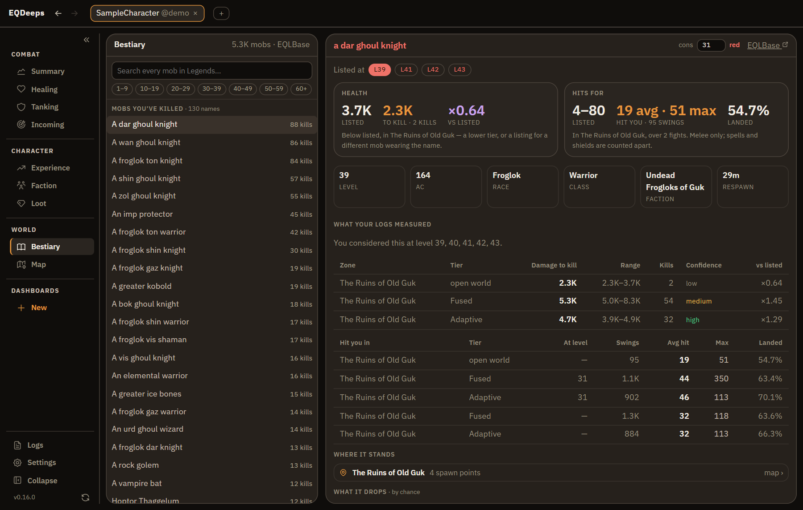
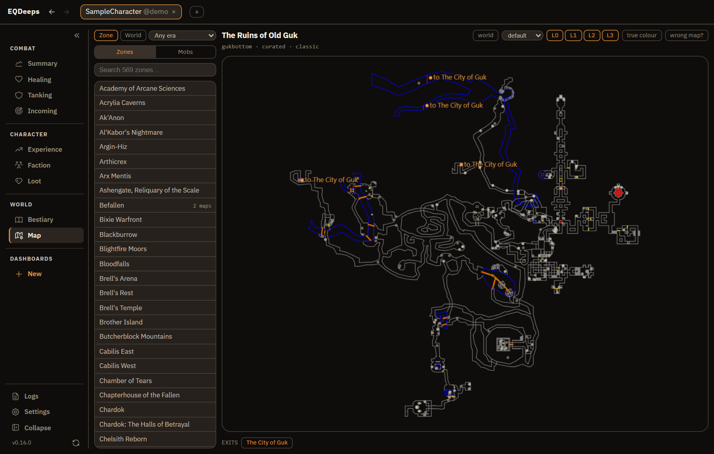
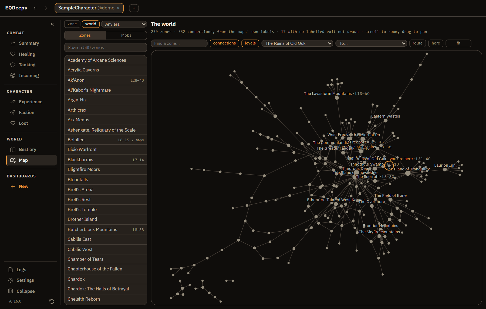

# EQDeeps

EQDeeps reads the log file EverQuest writes and shows you what happened in
it — damage, healing, tanking, deaths, loot, experience — live while you play
and for everything the log remembers. It runs on your own machine, every table
and chart is a query you can edit, and nothing is bundled that your install
already has. It is a clean-room successor to
[EQLogParser](https://github.com/kauffman12/EQLogParser), built around
composable queries and dashboards instead of fixed views.

Built and used day to day on **EverQuest Legends**. The log is the same format
every EverQuest server writes, so other servers' logs open too; the Bestiary's
listings, level bands and expansion list are Legends'.


**Status:** v0.16.0 — pre-1.0, used daily on real logs. Left before a public
v1: the release-gate consistency checks (per-player damage summing to the fight
total, every record landing in exactly one fight or none, lines-read
accounting), class detection from the client's own spell files, identity
persistence to disk, and the P1/P2 backlog — see
[features.md](docs/product/features.md).

## Get started

**1. Install** — from the [latest release](https://github.com/Moonchopper/EQDeeps/releases/latest).

- **Installer** (recommended): run `EQDeeps-Setup-x.y.z.exe`. It installs for
  you only, under `%LocalAppData%\Programs\EQDeeps`, with no administrator
  rights needed — the wizard still lets you pick any folder, or install for all
  users. Installed copies **keep themselves up to date**; see
  [Updates](#updates).
- **Portable zip**: unzip anywhere and run `EQDeeps.Server.exe`. Deleting the
  folder removes the app. Portable copies tell you when a new release exists
  but can't install it for you.

Either way you need 64-bit Windows 10 or 11 and nothing else: the window is
WebView2, the browser engine built into Windows, and no .NET install is
required. Your dashboards, settings and caches live in `%AppData%\EQDeeps`
whichever way you install.

> **First run:** releases are signed, but Windows SmartScreen builds reputation
> per file hash, so a brand-new release can still show "Windows protected your
> PC" until enough people have run it. Click **More info → Run anyway**; the
> prompt stops appearing as a release circulates.

**2. Open a log.** EQDeeps lists every log it can see — the one EverQuest is
writing right now, the ones in your installs, the ones you opened before — and
offers the bundled **sample**, two days of sanitized real play, so you can look
around before pointing it at your own. Logging has to be on in game
(`/log on`); the file is `Logs\eqlog_<Character>_<server>.txt` inside your
EverQuest folder, and if it isn't found you can paste the path. A log opens
fast the first time and faster after — what was parsed is cached, so reopening
resumes where you left off. **+** in the header opens another character beside
the first; **Logs** at the foot of the rail is the same picker later.

**3. Read it.** You land on **Summary**: the fight list down the right, the
damage, healing and tanking charts, the live meter, ability breakdowns, deaths
and an event timeline. Everything on screen reports over one **time frame** —
live by default (the last 15 minutes, following the clock through quiet time),
or click a fight to frame it, shift-click for a range, type a window (`-6h`,
`500m`) or set one absolutely, or zoom a chart and promote the zoom; **back to
live** is the way back. The rail on the left is grouped by the question a view
answers — **Combat**, **Character**, **World**, **Dashboards** — and collapses
to icons; **Logs** and **Settings** sit at its foot.

Closing the window exits the app, reopening resumes from the cache, and
launching the exe again focuses the already-open window. On machines without
the WebView2 runtime it falls back to your default browser, where deliberately
closing the last tab shuts the app down a few seconds later — backgrounded or
slept tabs do **not** stop it.

## What it does

**Combat**

- **Summary** — fight list, damage/healing/tanking over time, the live meter,
  ability breakdowns, deaths, event timeline. Fight bands sit behind every
  chart, a strip above them names the zone you were in and the level you were,
  and timeline marks are sized by what each cast landed.
- **Healing** and **Tanking** — the standard parses: rankings carrying overheal
  and crit beside the raw total, who received it and which spells did the work;
  damage taken with the defensive rates beside it, the hardest hitters, every
  death in the frame.
- **Stances** (when the log has them) — what switching cost you per second
  held, across damage, healing and damage taken alike.
- **Incoming** — the swings you took in the order they landed (deliberately not
  an aggregation: the sequence is the information, and every aggregation
  destroys it) beside what this server's mobs hit for, learned per zone, per
  instance difficulty *and per your level*, because how hard something hits is
  a fact about the pairing rather than about the mob.

**Character**

- **Experience** — XP and AA over time and per hour, measured against time
  actually played rather than the calendar the log spans.
- **Faction** — standing changes over time, per faction, across the whole log,
  since faction moves at kills and quest turn-ins alike.
- **Loot** — what dropped and what it sold for, joined to mob deaths so "per
  kill" is an answer rather than an estimate; plus an **Item feed** of
  everything looted, sold, bought or named in chat as it happens.

**World**

- **Bestiary** — every mob the game has, searchable and browsable by level. A
  mob's listed level, health, spawns and loot are fetched on demand from
  EQLBase and cached on your machine — never bundled, never fetched until you
  ask, switchable off — and shown beside what your own logs measured for the
  same mob at each difficulty tier, which is the comparison no site can make
  for you. Measured health comes from what it took to kill one, keyed by
  instance difficulty because the same froglok is a different fight at tier 1
  and tier 4, and reported as a band with a confidence grade rather than a
  number pretending to be a measurement. It opens on the mobs you have actually
  killed; pins keep a hunting list drawn on the maps; and it is joined to the
  Map both ways.
- **Map** — the zone maps EverQuest already put on your disk, so nothing is
  bundled and the drawings are the ones you have customized. Opens on the zone
  you are standing in, exits clickable, the listed mobs' spawn points drawn.
  Where the shipped zone table is wrong or silent you can correct it: the
  person who can see both the map and the game gets the last word.
- **World** — every zone and how they join up, as a zoomable graph built from
  the maps' own connection labels, the only place an install writes that down.
  Trim it to the expansion your server has reached once you say which; search
  by name, route across it, label each zone with the levels it is for, browse
  the world's mobs by level, and right-click any zone into its own map.

**Everywhere**

- **Lookup arrows** beside every item and mob name — in the fight list, the
  tables, the feeds, the death log, on the names down the side of a chart —
  open the community site that knows that name for the world your log is from:
  one click to the site you starred, right-click for the rest. Items are
  numbered from your own loot-filter file, so the id-addressed sites land on
  the exact page.
- **Linked highlight** — point at one reading of a player or mob and it lights
  up everywhere; click to keep it lit on this view, pin to keep it on every
  view and across restarts. Tables fuzzy-search and sort, with heat-ramped
  meters.
- **Spells from your own install** — the per-spell emotes a buff prints when
  it lands or fades are resolved against your game's spell files, so they
  become events instead of unrecognized lines, and the timeline draws buffs
  nobody watched being cast, with durations read from the same files.
- **Back and forward** over every screen — the arrows beside the name, the
  mouse's thumb buttons, or Alt+←/→.
- **Several characters at once**, each a tab in the header.
- **Custom dashboards** — clone a standard view or start from nothing; drag and
  resize panels; export a dashboard as a file and import it elsewhere. Every
  panel is a query — source, scope, trim, grouping, columns, exclusions — and
  the standard views are the same thing, written in code.

**Under the hood** — a .NET 8 server on `127.0.0.1` serving a React app:
≈1 GB/s backfill, a log parsed once and cached so the next open resumes ~3×
faster with half the memory, and under 250 ms from a line hitting the file to
it being on screen. Durations and rates are measured against time actually
played, not the calendar the log file spans — "plat per hour" over a window
that slept through half of it is two different questions, and the framed
range decides which.

## What it looks like

Every shot below is the bundled sample log — two days of sanitized real play
that ships inside the app — framed on one evening of it. The app offers it on
first run, so none of this needs EverQuest installed to reproduce, apart from
the Map and World, which draw the maps an install already has. One footnote:
the demo is deliberately kept out of the learned mob indexes, so on the sample
itself the Bestiary's measured tables and Incoming's lower half stay empty until
you open a log of your own — the shots open a copy of the sample as an ordinary
log to show them filled.

| | |
|---|---|
| [](docs/media/healing.png) | [](docs/media/tanking.png) |
| **Healing** — rankings carrying overheal and crit alongside the raw total, who received it, and which spells did the work. | **Tanking** — damage taken with the defensive rates beside it, the mobs that hit hardest, and every death in the frame. |
| [](docs/media/loot.png) | [](docs/media/experience.png) |
| **Loot** — what dropped and what it sold for, joined to mob deaths so "per kill" is an answer rather than an estimate. | **Experience** — XP and AA over time with the rate per hour, measured against time actually played rather than the calendar. |
| [](docs/media/incoming.png) | [](docs/media/bestiary.png) |
| **Incoming** — the swings you took, in the order they landed, above what this server's mobs hit for — learned per zone, per difficulty tier and per your level, because how hard something hits is a fact about the pairing. | **Bestiary** — every mob in the game, opening on the ones you have killed; a mob's page puts what EQLBase lists beside what your own logs measured for it at each difficulty tier, with a plain reading of how they compare. |
| [](docs/media/map.png) | [](docs/media/world.png) |
| **Map** — the zone you are standing in, drawn from the map files your own install already has: exits clickable, the Mobs tab naming who stands there, and a right-click away from the world. | **World** — every zone and how they join up, built from the maps' own connection labels; search it, route across it, trim it to your server's era, and label each zone with the levels it is for. |
| [](docs/media/dashboard.png) | [](docs/media/query-builder.png) |
| **Custom dashboards** — clone a standard view or start from nothing; drag panels, resize them, export one as a file and import it somewhere else. | **Query builder** — every panel is a query: source, scope, trim, grouping, columns, exclusions. The standard views are the same thing, written in code. |

## What it touches

EQDeeps runs entirely on your machine: no account, no telemetry, and the
server listens only on `127.0.0.1`.

- **Reads:** your log files, and from your EverQuest install the zone maps,
  the spell files and your loot-filter file (`userdata\LF_*.ini`, for item
  ids). Nothing in the install is ever written to.
- **Writes:** `%AppData%\EQDeeps` — dashboards, settings, the learned mob
  indexes, and the log cache.
- **Network:** two things, both optional. The update check against GitHub
  (`--no-update-check`, or "never check" in Settings), and the Bestiary's
  lookups from EQLBase, fetched only when you open something that needs one
  and cached after (`--no-reference`). Add `--no-spells`, which stops it
  reading the spell files, and it touches nothing but the log.

Flags, for when you want them: `--browser` (your default browser instead of
the app window), `--no-browser` (headless, no UI), `--stay-alive` (keep
parsing with no UI open), `--no-update-check`, `--no-reference`, `--no-spells`,
`--urls http://127.0.0.1:PORT`.

## Updates

Installed copies check GitHub for new releases and, by default, **ask you once
per release** before doing anything. The prompt offers:

| | What it does |
| --- | --- |
| **Update** | Downloads in the background; installs the next time you close EQDeeps |
| **Update & restart now** | Installs straight away and reopens on the new version |
| **Not right now** | Asks again next launch |
| **Skip this version** | Silent until something newer than that release ships |
| **Don't ask again for vX.Y.Z** | Silent until you're running a different version |
| **Update automatically from now on** | Stops asking; every release installs itself |

Updates are **never applied mid-session** — a download is staged quietly and
the swap happens after you close the app, so a raid parse is never
interrupted. The pill beside the version number shows what's happening and
offers **restart to update** if you want it sooner. Nothing is executed until
it passes both an Ed25519 signature check against a key built into the app and
a Windows Authenticode check.

Beside the version number, **⚙** opens update preferences (ask each time /
automatic / never check) and **⟳** checks on demand. A manual check overrides
every standing "no", including automatic mode — it always asks before
installing, so it's the way back if you've chosen "don't ask again". EQDeeps
also re-checks every few minutes on its own, so you never have to restart to
find out a release exists; declining a release is remembered, so that won't
nag.

## For developers

**From source:**

```
cd ui && npm install && npm run build && cd ..   # build the SPA into the backend
dotnet run --project src/EQDeeps.Server          # http://127.0.0.1:5487
```

Point it at an `eqlog_<Character>_<server>.txt` file — installed EverQuest logs
are autodetected. No EverQuest needed to try it; generate a realistic raid log:

```
dotnet run -c Release --project tools/EQDeeps.Bench -- gen %TEMP%\eqlog_Test_server.txt 5
```

Tests: `dotnet test` · Benchmarks: `dotnet run -c Release --project tools/EQDeeps.Bench -- all` ·
UI dev loop: `dotnet run --project src/EQDeeps.Server` + `cd ui && npm run dev`.

**Package & share:** `powershell -File scripts/publish.ps1` produces a
self-contained `artifacts/win-x64/` folder: `EQDeeps.Server.exe` (SPA
embedded) with its runtime, plus `LICENSE.txt`, `NOTICE.txt`,
`THIRD-PARTY-NOTICES.txt` and a `licenses\` folder holding the .NET runtime's
own — all of which must accompany any copy you distribute. Zip the folder and
it runs on any 64-bit Windows machine. Add `-Installer` to also compile
`artifacts/installer/EQDeeps-Setup-x.y.z.exe` — that needs
[Inno Setup 6](https://jrsoftware.org/isdl.php)
(`winget install JRSoftware.InnoSetup`).

**Releases** ship by pushing a git tag: `git tag v0.x.y && git push origin
v0.x.y` makes CI test, publish, sign, build the installer, and create a GitHub
release with the installer, the portable zip, and the signed app cast that
drives auto-update (see `.github/workflows/release.yml`). The release notes
come from [CHANGELOG.md](CHANGELOG.md).

### Documentation

| Doc | Purpose |
|---|---|
| [docs/HANDOFF.md](docs/HANDOFF.md) | Implementation brief, build order, current status |
| [docs/product/vision.md](docs/product/vision.md) | What/why/who, UX pillars, non-goals |
| [docs/product/features.md](docs/product/features.md) | P0/P1/P2 feature spec with implementation status |
| [docs/domain/eq-log-format.md](docs/domain/eq-log-format.md) | EverQuest log-line taxonomy with real examples |
| [docs/domain/metrics-and-aggregation.md](docs/domain/metrics-and-aggregation.md) | Fight segmentation, counters, metric formulas |
| [docs/domain/eq-legends-loadouts.md](docs/domain/eq-legends-loadouts.md) | Why one character carries several levels and classes on EQ Legends, and what that does to anything reading a level, a class or an item |
| [docs/domain/eq-map-format.md](docs/domain/eq-map-format.md) | What EverQuest's zone map files contain and how to read them — no published spec exists, so the corpus is the authority |
| [docs/domain/eq-client-files.md](docs/domain/eq-client-files.md) | What the game client keeps on disk, and which item, NPC, spell and zone facts the app can learn from it without a website |
| [docs/architecture/system-overview.md](docs/architecture/system-overview.md) | Stack, components, the QuerySpec model |
| [docs/architecture/log-ingestion-brief.md](docs/architecture/log-ingestion-brief.md) | Design brief for the file-reading layer |
| [docs/architecture/adr-001…020](docs/architecture/) | Decisions as they were made: parser, ingestion, session state, query engine, API/live, SPA, dashboards, packaging, windowed shell, auto-update, gear snapshots (withdrawn), mob health, incoming damage, navigation rail, visual language, zone maps, grouped rail, log cache, reference lookup, NPC reference |
| [docs/architecture/adr-020-npc-reference.md](docs/architecture/adr-020-npc-reference.md) | Where the Bestiary's data comes from, its measured coverage and licence, and why it is fetched on demand rather than bundled |
| [docs/release-signing.md](docs/release-signing.md) | Azure Artifact Signing setup for signed releases and auto-update |

Locked decisions: .NET 8 backend + React/TypeScript SPA, realtime via SignalR,
multi-character monitoring from day one, permissive-license dependencies only
(attribution in [NOTICE](NOTICE), licence text in
[THIRD-PARTY-NOTICES.txt](THIRD-PARTY-NOTICES.txt)), Windows-first, public
release as the end goal.

## Contributing

Bug reports and pull requests are welcome; the most useful thing anyone can send
is a log line EQDeeps gets wrong, with what it should have meant.
[CONTRIBUTING.md](CONTRIBUTING.md) covers the setup, the house conventions, and
the one procedural requirement: commits carry a `Signed-off-by` line certifying
the [Developer Certificate of Origin](https://developercertificate.org/), which
`git commit -s` writes for you.

## License

EQDeeps' own code is [MIT](LICENSE). The components bundled with it keep the
licences they arrived under — MIT, Apache-2.0, BSD, and the SIL Open Font
License for IBM Plex Sans — with every text in
[THIRD-PARTY-NOTICES.txt](THIRD-PARTY-NOTICES.txt) and the plain-language
summary of where each came from in [NOTICE](NOTICE). Both are installed beside
the app and are in the portable zip, along with the .NET runtime's own licence
and notices; a redistributed copy needs all of them.

The MIT grant covers the code and not the name: if you distribute a modified
build, give it your own name, so that "EQDeeps" keeps meaning one set of
numbers. [TRADEMARKS.md](TRADEMARKS.md) is the whole policy and it is short.
EverQuest is a registered trademark of Daybreak Game Company LLC; EQDeeps is an
unaffiliated fan-made tool.
