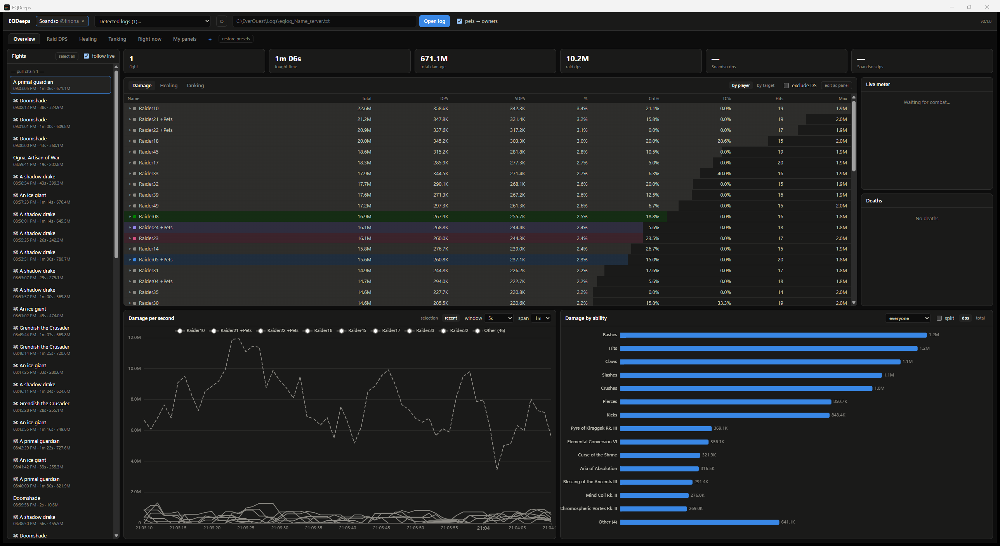
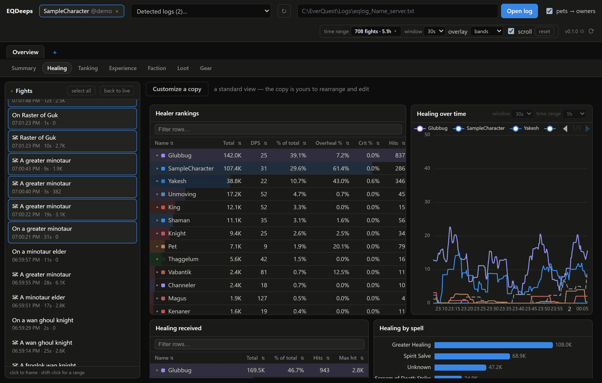
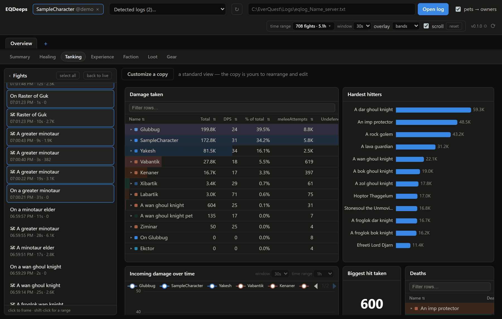
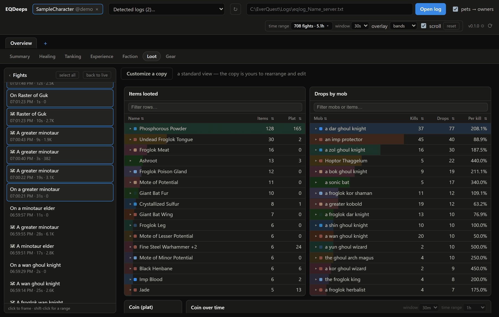
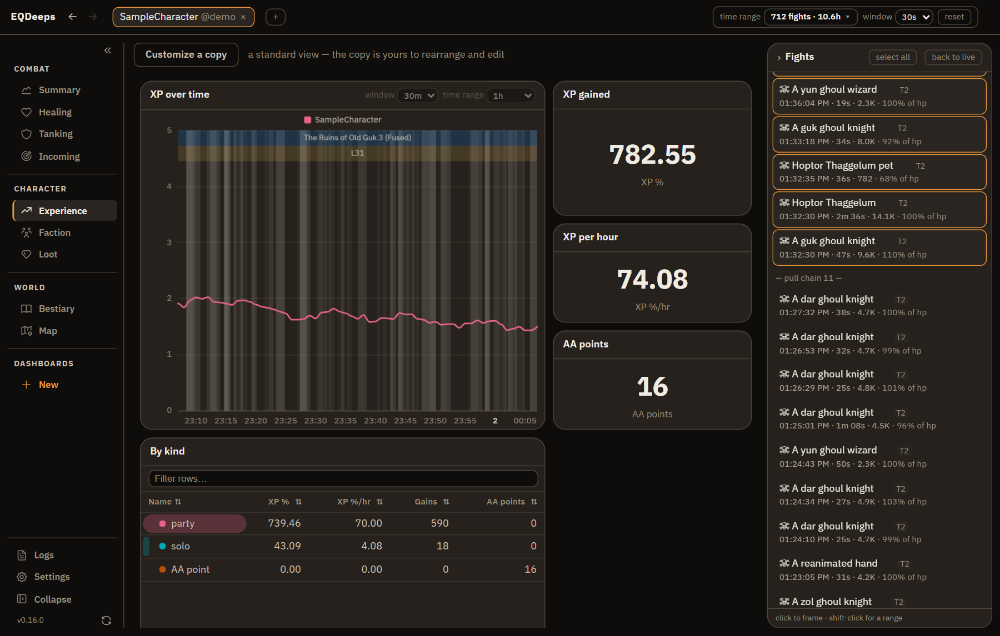
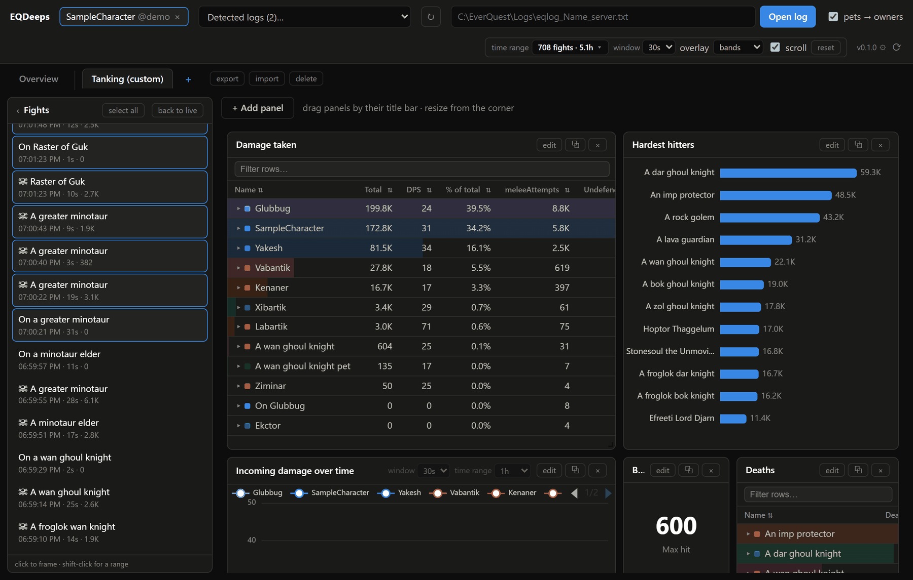
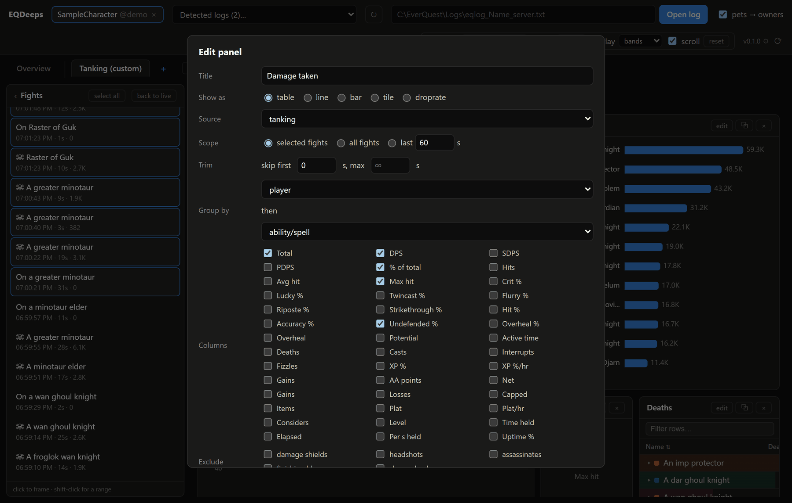

# EQDeeps

A modern, real-time EverQuest combat-log analytics app — a clean-room successor to [EQLogParser](https://github.com/kauffman12/EQLogParser) built around composable queries and dashboards instead of fixed views.



**Status: v0.11.1 released.** Parser core, ingestion (≈1 GB/s backfill, sub-250 ms live latency), fight/session state, the composable query engine, a localhost REST + SignalR backend, one app-wide time frame — a live tail that follows the wall clock through quiet time, a range picked off the fight list, a window typed in (`-6h`, `500m`) or set absolutely, or one promoted straight off a chart you zoomed into — the Summary view (fight list, damage/healing/tanking trends, live meter, ability breakdowns, deaths, event timeline) with fight bands behind every chart, a strip above them naming the zone the character was in and the level they were, and timeline marks sized by what each cast landed, read-only standard views for healing, tanking, stances, experience, faction and loot — loot answering drop rates per kill by joining it to mob deaths, stances answering what switching cost you per second held across damage, healing and damage taken alike — tables you can fuzzy-search and sort with heat-ramped breakdown meters, one entity lit up everywhere at once when you point at any reading of it, a Mobs tab that learns how much health a mob has by measuring what it takes to kill one — keyed by instance difficulty, because the same froglok is a different fight at tier 1 and tier 4, and reported as a band with a confidence grade rather than a number pretending to be a measurement — an Incoming tab answering what is hitting you, pairing the swings you took in the order they landed (the one view here that is deliberately not a query, because the sequence is the information and every aggregation destroys it) with what this server's mobs hit for, learned per zone, per difficulty *and per your level*, since how hard something hits is a fact about the pairing rather than about the mob — a Map tab reading the zone maps EverQuest already put on your disk, so nothing is bundled and the drawings are the ones you have customized, opening on the zone you are standing in, with the exits clickable and the whole world laid out as a zoomable graph you can route across, built from the maps' own connection labels because that is the only place an EverQuest install writes down how zones join up, and trimmed to the expansion your server has actually reached once you say which, since nothing on the disk can — and correctable where the shipped zone table is wrong or silent, since it is knowingly incomplete and the person who can see both the map and the game gets the last word — custom dashboards with a full query-builder UI, log autodetection, a WebView2 windowed shell, and signed CI releases shipping a per-user installer plus a portable zip, with consent-driven auto-updating — durations and rates measured against time actually played rather than against the calendar the log file spans — a choice on a framed range, where "plat per hour" over a window that slept through half of it is two different questions, and validated through day-to-day use on real logs. Remaining before public v1: a systematic number-comparison harness against EQLogParser, spell-DB integration (class detection, bane, lands-on resolution), identity persistence to disk, and the P1/P2 backlog — see [features.md](docs/product/features.md).

## What it looks like

Every shot below is the bundled sample log — two days of sanitized real play
that ships inside the app — framed on one evening of it. The app offers it on
first run, so none of this needs EverQuest installed to reproduce.

| | |
|---|---|
| [](docs/media/healing.png) | [](docs/media/tanking.png) |
| **Healing** — rankings carrying overheal and crit alongside the raw total, who received it, and which spells did the work. | **Tanking** — damage taken with the defensive rates beside it, the mobs that hit hardest, and every death in the frame. |
| [](docs/media/loot.png) | [](docs/media/experience.png) |
| **Loot** — what dropped and what it sold for, joined to mob deaths so "per kill" is an answer rather than an estimate. | **Experience** — XP and AA over time with the rate per hour, measured against time actually played rather than the calendar. |
| [](docs/media/dashboard.png) | [](docs/media/query-builder.png) |
| **Custom dashboards** — clone a standard view or start from nothing; drag panels, resize them, export one as a file and import it somewhere else. | **Query builder** — every panel is a query: source, scope, trim, grouping, columns, exclusions. The standard views are the same thing, written in code. |

## Run it

**Installer** (recommended, [latest release](https://github.com/Moonchopper/EQDeeps/releases/latest)):
run `EQDeeps-Setup-x.y.z.exe`. It installs for you only, under
`%LocalAppData%\Programs\EQDeeps`, with no administrator rights needed — the
wizard still lets you pick any folder, or install for all users if you'd rather.
Installed copies **keep themselves up to date**: see [Updates](#updates) below.

**Portable zip** (same release): unzip and run `EQDeeps.Server.exe` — nothing is
written outside the folder and deleting it removes the app. Portable copies
tell you when a new release exists but can't install it for you.

Either way the app opens in its own
window (WebView2, the browser engine built into Windows 10/11). No
.NET required. Closing the window exits the app (reopening backfills from the
log, so nothing is lost), and launching the exe again focuses the already-open
window. On machines without the WebView2 runtime it falls back to your default
browser, where deliberately closing the last tab shuts the app down a few
seconds later — backgrounded or slept tabs do **not** stop it. Flags:
`--browser` (use your default browser instead of the app window),
`--no-browser` (headless, no UI), `--no-update-check`, `--stay-alive` (keep
parsing with no UI open), `--urls http://127.0.0.1:PORT`.

> **First run:** releases are signed, but Windows SmartScreen builds reputation
> per file hash, so a brand-new release can still show "Windows protected your
> PC" until enough people have run it. Click **More info → Run anyway**; the
> prompt stops appearing as a release circulates.

## Updates

Installed copies check GitHub for new releases and, by default, **ask you once
per release** before doing anything. The prompt offers:

| | What it does |
| --- | --- |
| **Update** | Downloads in the background; installs the next time you close EQDeeps |
| **Update & restart now** | Installs straight away and reopens on the new version |
| **Not right now** | Asks again next launch |
| **Skip this version** | Silent until something newer than that release ships |
| **Don't ask again for vX.Y.Z** | Silent until you're running a different version |
| **Update automatically from now on** | Stops asking; every release installs itself |

By default updates are **never applied mid-session** — a download is staged
quietly and the swap happens after you close the app, so a raid parse is never
interrupted. The pill beside the version number shows what's happening and
offers **restart to update** if you want it sooner. Nothing is executed until it
passes both an Ed25519 signature check against a key built into the app and a
Windows Authenticode check.

Beside the version number, **⚙** opens update preferences (ask each time /
automatic / never check) and **⟳** checks on demand. A manual check overrides
every standing "no", including automatic mode — it always asks before installing,
so it's the way back if you've chosen "don't ask again". EQDeeps also re-checks
every few minutes on its own, so you never have to restart to find out a release
exists. That won't nag: declining a release is remembered, so a shorter interval
only changes how quickly an update is noticed.

Prefer no network calls at all? `--no-update-check` disables the whole thing for
a run, and the in-app setting has a "never check" mode.

**From source**:

```
cd ui && npm install && npm run build && cd ..   # build the SPA into the backend
dotnet run --project src/EQDeeps.Server          # http://127.0.0.1:5487
```

Point it at an `eqlog_<Character>_<server>.txt` file — installed EverQuest logs
are autodetected. No EverQuest needed to try it; generate a realistic raid log:

```
dotnet run -c Release --project tools/EQDeeps.Bench -- gen %TEMP%\eqlog_Test_server.txt 5
```

Tests: `dotnet test` · Benchmarks: `dotnet run -c Release --project tools/EQDeeps.Bench -- all` ·
UI dev loop: `dotnet run --project src/EQDeeps.Server` + `cd ui && npm run dev`.

## Package & share

`powershell -File scripts/publish.ps1` produces a self-contained
`artifacts/win-x64/` folder: `EQDeeps.Server.exe` (SPA embedded) with its
runtime, plus `NOTICE.txt`, which must accompany any copy you distribute. Zip
the folder and it runs on any 64-bit Windows machine. Add `-Installer` to also
compile `artifacts/installer/EQDeeps-Setup-x.y.z.exe` — that needs
[Inno Setup 6](https://jrsoftware.org/isdl.php)
(`winget install JRSoftware.InnoSetup`).

Releases ship by pushing a git tag: `git tag v0.x.y && git push origin v0.x.y`
makes CI test, publish, sign, build the installer, and create a GitHub release
with the installer, the portable zip, and the signed app cast that drives
auto-update (see `.github/workflows/release.yml`) — that's how
[v0.1.0](https://github.com/Moonchopper/EQDeeps/releases/tag/v0.1.0) was built.

## Documentation

| Doc | Purpose |
|---|---|
| [docs/HANDOFF.md](docs/HANDOFF.md) | Implementation brief, build order, current status |
| [docs/product/vision.md](docs/product/vision.md) | What/why/who, UX pillars, non-goals |
| [docs/product/features.md](docs/product/features.md) | P0/P1/P2 feature spec with implementation status |
| [docs/domain/eq-log-format.md](docs/domain/eq-log-format.md) | EverQuest log-line taxonomy with real examples |
| [docs/domain/metrics-and-aggregation.md](docs/domain/metrics-and-aggregation.md) | Fight segmentation, counters, metric formulas |
| [docs/architecture/system-overview.md](docs/architecture/system-overview.md) | Stack, components, the QuerySpec model |
| [docs/architecture/log-ingestion-brief.md](docs/architecture/log-ingestion-brief.md) | Design brief for the file-reading layer |
| [docs/architecture/adr-001…010](docs/architecture/) | Decisions per phase: parser, ingestion, session state, query engine, API/live, SPA, dashboards, packaging, windowed shell, auto-update |
| [docs/release-signing.md](docs/release-signing.md) | Azure Artifact Signing setup for signed releases and auto-update |

Locked decisions: .NET 8 backend + React/TypeScript SPA, realtime via SignalR, multi-character monitoring from day one, permissive-license dependencies only (attribution in [NOTICE](NOTICE)), Windows-first, public release as the end goal.

## License

[MIT](LICENSE). Third-party attributions live in [NOTICE](NOTICE), which must
accompany any distributed copy. EverQuest is a registered trademark of Daybreak
Game Company LLC; EQDeeps is an unaffiliated fan-made tool.
